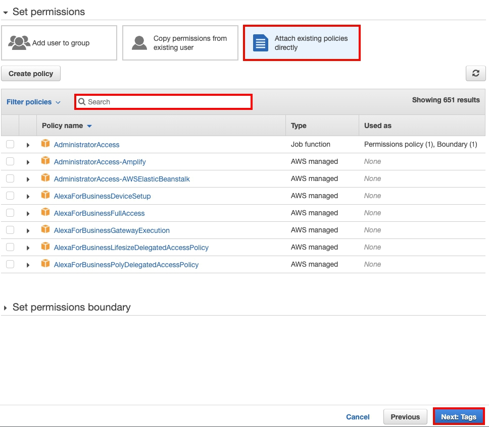
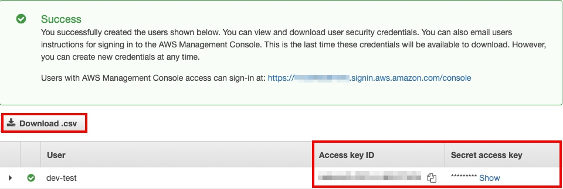
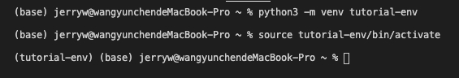
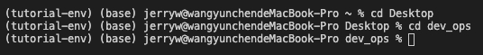
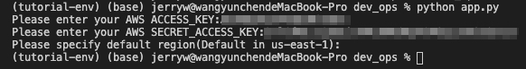
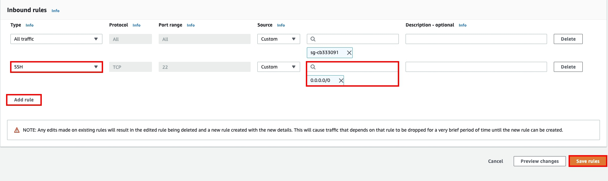
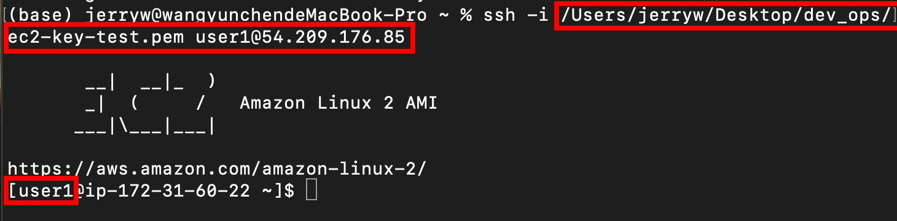
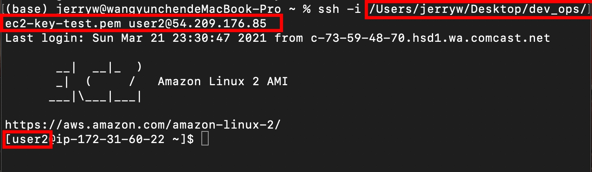

# DevOps Practice (EC2 automation by Boto3)

Our main goal in this tutorial is to develop an **automation program** that takes a YAML configuration file as input value and deploys a **Linux AWS EC2 instance** with **two volumes attached** and **two different users**.

(In this tutorial, our Operating System is MacOs)

## Prerequisite
- AWS Account
- Access Key & Secret Access Key
- IAM User with role attactched
- EC2 Keypair

## General guidelines to follow:

- Install all required packages inside requirements.txt
- Create **Python3.7 ↑ virtual environment**. Follow [Virtual Environments and Packages](https://docs.python.org/3/tutorial/venv.html) if further instruction is needed
- If you are using an existing key, include **key_name** and value in **server** section of confing.yaml.
- You can include subnet and security groups information in config.yaml too.
- Start the application, it'll ask you for AWS credentials. You should specify your own AWS credentials, you can change the region or leave it as default


## Step 1: Change key_name in YAML configuration file

1. The following section is the template of YAML file

```
---
# This YAML configuration specifies a server with two volumes and two users
server:
  server:
  instance_type: t2.micro
  ami_type: amzn2
  architecture: x86_64
  root_device_type: ebs
  virtualization_type: hvm

  ## Change it to your own keypair's name ##
  key_name: 'your_keys_name'
  ## Change it to your own keypair's name ##

  min_count: 1
  max_count: 1
  volumes:
    - device: /dev/xvda
      size_gb: 10
      type: ext4
      mount: /
    - device: /dev/xvdf
      size_gb: 100
      type: xfs
      mount: /data
  users:
    - login: user1
      ssh_key: --user1 ssh public key goes here-- user1@localhost
    - login: user2
      ssh_key: --user2 ssh public key goes here-- user2@localhost
```
2. Make sure to change the **your_keys_name** to your own key's name
    - Example > **key_name: ec2-key-test**
  
## Step 2: Create IAM user and assign required roles to it, also save credentials for further use

1. Login to your AWS account, go to **IAM**

2. On the left panel, go to **Users**, then click **Add user**

3. For User name, enter: **dev-test**
4. For Access type, select **Programmatic access**, then click **Next: Permissions**

<p align = "center">
      
      </p>


5. For Set permissions, select **Attach existing policies directly**
6. From Filter policies, seach for the following policies and make sure they are selected, then click **Next: Tags**
   
   - **AmazonEC2FullAccess**
   - **AmazonSSMFullAccess**
  
<p align = "center">
      
      </p>

7. Click **Next: Review**, then click **Create user**

8. After you click Create user, you will see your **Access key ID** and **Secret access key**, make sure you copied them to your clipboard for further use, or you can just download the .csv file

<p align = "center">
      
      </p>

## Step 3: Run app.py to execute the automation program

1. In this tutorial we are going to use **Visual Studio Code** as our IDE, where we install our **Python Virtual Environment**, and where we execute our code

2. On the top panel, go to Terminal, then select **New Terminal**

3. Install **Python Virtual Environment** by running the following command:
   - ```python3 -m venv tutorial-env```
     - On Windows, run: ```tutorial-env\Scripts\activate.bat```
     - On Unix or MacOs, run: ```source tutorial-env/bin/activate```
<p align = "center">
      
      </p>

4. Navigate to the folder to where you save your app.py file by the command ```cd 'file location'```
   - For example, if my app.py file saves at a folder named 'dev_ops' on the desktop:
  
<p align = "center">
      
      </p>

5. Run ```python app.py``` to execute app.py, it will ask you to enter your Access key, Secret access key, and specify a region (can leave as default)

<p align = "center">
      
      </p>

## Step 3: Connect to your EC2 instnace by 2 different users to check if it can read/ write to volumes

1. Login to your AWS account, go to **EC2**

2. On the left panel, select **Security Groups** then select the **default** security group
3. Click **Edit inbound rules** to add permissions
4. Click **Add rule**, select **SSH** for Type, select ```0.0.0.0/0``` for source, then click **Save rules**
   <p align = "center">
      
      </p>
5. On the left panel, select **Instances**, you shold see a running instance that just created by app.py

6. You can check the following details, it will be the same as the value that we specified in config.yaml:
   - Instance type
   - AMI
   - key pair name
   - virtualization type
   - Storage: 2 different EBS volumes attached with the size specified
   
7. Make sure to copy the **Public IPv4 address** of the instance to your clipboard for further use

8. Now we are going to connect to the EC2 instance, you can follow this document to connect:
   - [Connect to Your Amazon EC2 Instance](https://docs.aws.amazon.com/quickstarts/latest/vmlaunch/step-2-connect-to-instance.html#sshclient)

9. To connect to your EC2 instances by 2 different users, you can try the following command:
    - ssh -i **'location of your keypair file'** user1@**'Public IPv4 address'**
    - - ssh -i **'location of your keypair file'** user2@**'Public IPv4 address'**
   <p align = "center">
      
      </p>
    <p align = "center">
      
      </p>

    
